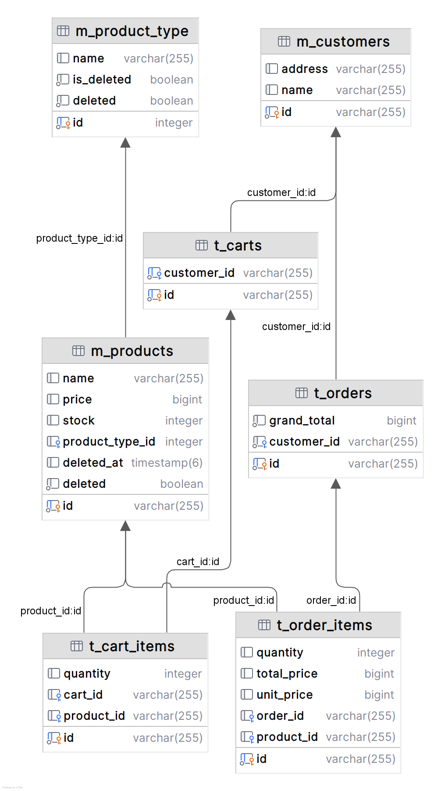
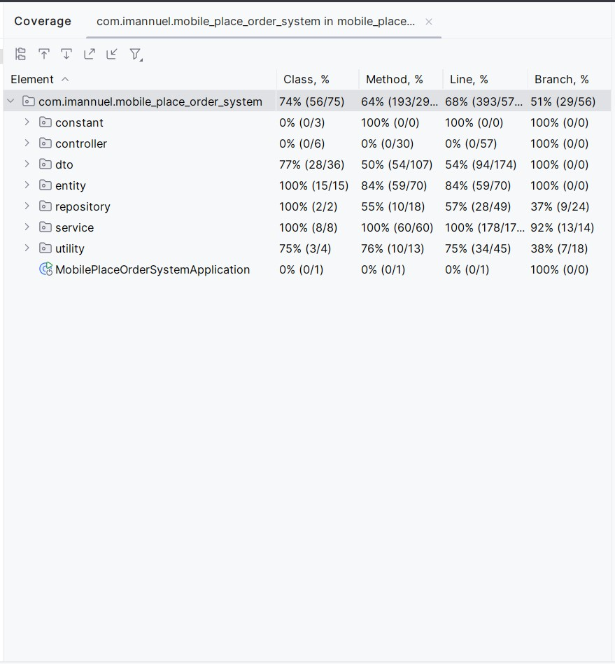

# Mobile Place Order System

### Technologies Used

- Java 17
- Spring JPA
- Jakarta Validation
- Lombok
- PostgreSQL

### Database Schema



### Getting Started
run project with maven:
1. Clone repository
   `git clone https://github.com/GtFoBAE05/mobile_place_order_system`
2. Open project directory
3. Replace variable on application.properties, or you can configure .env
4. Build project
   `mvn clean install`
5. Run application
   `mvn spring-boot:run`

### Filtering and sorting
- Filtering number:
  - format: {operator}:{value}
  - example: 
    - single filter: ```gte:50```
    - multiple filtering: ```lte:100,gte:25```
  - list of supported operator:
    - equal: e
    - grater than: gt
    - greater than equal: gte
    - less than: lt
    - less than equal: lte
- sorting field:
  - format: {field}_{direction}
  - example 
    - single sort: ```name_asc```
    - multiple sort: ```name_asc,address_desc```
  - list of direction:
    - ascending: asc
    - descending: desc

### API Endpoint

via Postman Collection [mobile place order system.postman_collection.json](mobile%20place%20order%20system.postman_collection.json) or check bellow

1. Customer
    - POST `/api/customers`: Create new customer

        - request:
           ```json
                 {
                     "name": "{customerName}",
                     "address": "{customerAddress}"
                 }
           ```
        - Success Response:
           ```json
               {
                   "success": true,
                   "message": "Success create customer",
                   "data": {
                       "customerId": "{customerId}",
                       "name": "{customerName}",
                       "address": "{customerAddress}"
                   },
                   "pagination": null
               }
           ```
    - GET `/api/customers`: Get all customer
        - request parameter:
            - page
            - size
            - sortBy

        - response
          ```json
               {
                  "success": true,
                  "message": "Success fetch all customers",
                  "data": [
                       {
                           "customerId": "9d1c3d69-50c4-49f9-af9b-5dd14a8df4cb",
                           "name": "susi",
                           "address": "jalan mangga"
                       },
                       {
                           "customerId": "123f26b8-7edf-4f45-bb90-78dd02c94418",
                           "name": "Budi",
                           "address": "1246"
                       }
                   ]
               }
          ```

    - GET `/api/customers/{customerId}`: Get customer by customerId
        - response
            ```json
            {
               "success": true,
               "message": "Success find customers ",
               "data": 
                    {
                        "customerId": "9d1c3d69-50c4-49f9-af9b-5dd14a8df4cb",
                        "name": "susi",
                        "address": "jalan mangga"
                    }
                
            }
            ```

    - PUT `/api/customers/{customerId}`: Update customer
        - request:
            ```json
                  {
                      "name": "{customerName}",
                      "address": "{customerAddress}"
                  }
            ```
        - Success Response:
           ```json
               {
                   "success": true,
                   "message": "Success update customer",
                   "data": {
                       "customerId": "{customerId}",
                       "name": "{customerName}",
                       "address": "{customerAddress}"
                   },
                   "pagination": null
               }
           ```

2. Product Type
    - POST `/api/product-types`: Create new product types

    - request:
       ```json
             {
                 "name": "{productTypeName}"
             }
       ```
    - Success Response:
       ```json
           {
               "success": true,
               "message": "Success create product type",
               "data": {
                    "productTypeId": 8,
                    "productTypeName ": "Toys"
                    },
               "pagination": null
           }
       ```
        - Failed because product type is already exists:
          ```json
              {
                  "success": false,
                  "message": "Product type already exists",
                  "data": null,
                  "pagination": null
              }
          ```
        - GET `/api/product-types`: Get all product type
            - request parameter:
                - page
                - size
                - sortBy
                - name
            - success response
              ```json
                   {
                      "success": true,
                      "message": "Success fetch all product types",
                      "data": [
                           {
                               "productTypeId": 6,
                               "productTypeName": "Book"
                           },
                            {
                                "productTypeId": 4,
                                "productTypeName": "Food"
                            }
                       ]
                   }
              ```

    - GET `/api/product-types/{productTypeId}`: Get product type by productTypeId
        - Success Response
            ```json
            {
               "success": true,
               "message": "Success find product type",
               "data": {
                             "productTypeId": 6,
                             "productTypeName": "Book"
                       }
            }
            ```

        -
            - Failed because product type is not found:
               ```json
                   {
                       "success": false,
                       "message": "Product type not found",
                       "data": null,
                       "pagination": null
                   }
               ```

    - PUT `/api/product-types/{productTypeId}`: Update product type
        - request:
            ```json
                  {
                      "name": "{productTypeName}"
                  }
            ```
        - Success Response:
           ```json
               {
                   "success": true,
                   "message": "Success update product type",
                   "data": {
                             "productTypeId": 6,
                             "productTypeName": "Book"
                         },
                   "pagination": null
               }
           ```
        - Failed because product type is already exists:
          ```json
              {
                  "success": false,
                  "message": "Product type already exists",
                  "data": null,
                  "pagination": null
              }
          ```
        - Failed because product type is not found:
           ```json
               {
                   "success": false,
                   "message": "Product type not found",
                   "data": null,
                   "pagination": null
               }
           ```

        - DELETE `/api/product-types/{productTypeId}`: Delete product type
        -
            - Success Response:
               ```json
                   {
                       "success": true,
                       "message": "Success update product type",
                       "data": null,
                       "pagination": null
                   }
               ```
        -
            - Failed because product type is used by product Response:
               ```json
                   {
                       "success": false,
                       "message": "Product type is used by product",
                       "data": null,
                       "pagination": null
                   }
               ```
        -
            - Failed because product type is not found:
               ```json
                   {
                       "success": false,
                       "message": "Product type not found",
                       "data": null,
                       "pagination": null
                   }
               ```

3. Product
    - POST `/api/products`: Create new product
        - request:
           ```json
                 {
                     "name": "Dining Table",
                     "productTypeId": 7,
                     "stock": 15,
                     "price": 210000
                 }
           ```
        - Success Response:
           ```json
               {
                   "success": true,
                   "message": "Success create product",
                   "data": {
                           "productId": "94088092-ffa4-4e0d-862f-0de2b31ed1de",
                           "productName": "Dining Table",
                           "productType": {
                              "productTypeId": 7,
                              "productTypeName": "Bag"
                                 },
                           "stock": 15,
                           "price": 210000
                        },
                   "pagination": null
               }
           ```
        - Failed because product type is not found:
          ```json
              {
                  "success": false,
                  "message": "Product type not found",
                  "data": null,
                  "pagination": null
              }
          ```
        - Failed because product invalid price:
          ```json
              {
                  "success": false,
                  "message": "price: price must be at least 1",
                  "data": null,
                  "pagination": null
              }
          ```
    - GET `/api/products`: Get all product
        - request parameter:
            - page
            - size
            - sortBy
            - name
            - productTypeId
            - price
            - stock
        - success response
          ```json
               {
                  "success": true,
                  "message": "Success fetch all product",
                  "data": [
                       {
                            "productId": "ed542221-88b2-4ff3-8561-ec15232d2fdf",
                            "productName": "Zenix",
                            "productType": {
                                "productTypeId": 5,
                                "productTypeName": "Vehicle"
                            },
                            "stock": 2,
                            "price": 210000000
                       },
                       {
                            "productId": "ae36811a-9fac-4567-86c5-376822924b87",
                            "productName": "Macbook",
                            "productType": {
                                 "productTypeId": 3,
                                 "productTypeName": "Laptop"
                             },
                            "stock": 48,
                            "price": 12000000
                       }
                   ]
               }
          ```
    - GET `/api/products/{productId}`: Get product by productId
        - Success Response
            ```json
            {
               "success": true,
               "message": "Success find product",
               "data": {
                                "productId": "ae36811a-9fac-4567-86c5-376822924b87",
                                "productName": "Macbook",
                                "productType": {
                                     "productTypeId": 3,
                                     "productTypeName": "Laptop"
                                 },
                                "stock": 48,
                                "price": 12000000
                        }
            }
            ```
            - Failed because product is not found:
               ```json
                   {
                       "success": false,
                       "message": "Product not found",
                       "data": null,
                       "pagination": null
                   }
               ```
    - PUT `/api/products/{productId}`: Update product
        - request:
            ```json
                  {
                       "name": "Dining Table",
                       "productTypeId": 7,
                       "stock": 15,
                       "price": 210000
                  }
            ```
        - Success Response:
           ```json
               {
                   "success": true,
                   "message": "Success update product",
                   "data": {
                             "productId": "94088092-ffa4-4e0d-862f-0de2b31ed1de",
                             "productName": "Dining Table",
                             "productType": {
                                           "productTypeId": 7,
                                           "productTypeName": "Bag"
                                       },
                              "stock": 15,
                              "price": 210000
                         },
                   "pagination": null
               }
           ```
        - Failed because product is not found:
           ```json
               {
                   "success": false,
                   "message": "Product not found",
                   "data": null,
                   "pagination": null
               }
           ```
    - DELETE `/api/products/{productId}`: Delete product
        - Success Response:
            ```json
                {
                    "success": true,
                    "message": "Success delete product",
                    "data": null,
                    "pagination": null
                }
            ```
        - Failed because product is not found:
           ```json
               {
                   "success": false,
                   "message": "Product not found",
                   "data": null,
                   "pagination": null
               }
           ```

4. Cart
    - POST `/api/carts`: Add item to cart
        - request:
      ```json
            {
                "productId": "50ce757b-6690-4d47-ba5d-4159884672d8",
                "quantity": 1
            }
      ```
        - Success Response:
           ```json
            {
              "success": true,
              "message": "Success add product to cart",
              "data": {
                  "cartId": "d9383752-ecb2-4460-9a43-4a01b7981f3c",
                  "customer": {
                      "customerId": "9d1c3d69-50c4-49f9-af9b-5dd14a8df4cb",
                      "name": "susi",
                      "address": "jalan mangga"
                  },
                  "items": [
                      {
                          "cartItemId": "7e07dc4c-e9fc-4104-a7eb-045315886c9c",
                          "productId": "50ce757b-6690-4d47-ba5d-4159884672d8",
                          "productName": "Supra",
                          "productType": "Vehicle",
                          "quantity": 1,
                          "price": 18000000,
                          "totalPrice": 18000000
                      }
                  ]
              },
              "pagination": null
            }
            ```
        - Failed because product is not found:
          ```json
            {
               "success": false,
               "message": "Product not found",
               "data": null,
               "pagination": null
            }
          ```
        - Failed because quantity invalid price:
             ```json
            {
                "success": false,
                "message": "quantity: quantity must be at least 1",
                "data": null,
                "pagination": null
            }
           ```
        - Failed because product not found:
             ```json
            {
                "success": false,
                "message": "Product not found",
                "data": null,
                "pagination": null
            }
           ```
        - Failed because customer not found:
             ```json
            {
                "success": false,
                "message": "customer not found",
                "data": null,
                "pagination": null
            }
           ```

    - GET `/api/carts/{customerId}`: Get customer cart
        - success response
          ```json
               {
                   "success": true,
                   "message": "Success add product to cart",
                    "data": {
                         "cartId": "d9383752-ecb2-4460-9a43-4a01b7981f3c",
                         "customer": {
                             "customerId": "9d1c3d69-50c4-49f9-af9b-5dd14a8df4cb",
                             "name": "susi",
                             "address": "jalan mangga"
                         },
                    "items": [
                         {
                                 "cartItemId": "7e07dc4c-e9fc-4104-a7eb-045315886c9c",
                                 "productId": "50ce757b-6690-4d47-ba5d-4159884672d8",
                                 "productName": "Supra",
                                 "productType": "Vehicle",
                                 "quantity": 1,
                                 "price": 18000000,
                                 "totalPrice": 18000000
                             }
                         ]
                 },
                 "pagination": null
              }
          ```

        - PUT `/api/carts/{customerId}`: Update cart
            - request:
              ```json
                   {
                      "productId": "50ce757b-6690-4d47-ba5d-4159884672d8",
                      "quantity": 1
                   }
              ```
            - Success Response:
               ```json
                {
                  "success": true,
                  "message": "Success add product to cart",
                  "data": {
                      "cartId": "d9383752-ecb2-4460-9a43-4a01b7981f3c",
                      "customer": {
                          "customerId": "9d1c3d69-50c4-49f9-af9b-5dd14a8df4cb",
                          "name": "susi",
                          "address": "jalan mangga"
                      },
                      "items": [
                          {
                              "cartItemId": "7e07dc4c-e9fc-4104-a7eb-045315886c9c",
                              "productId": "50ce757b-6690-4d47-ba5d-4159884672d8",
                              "productName": "Supra",
                              "productType": "Vehicle",
                              "quantity": 1,
                              "price": 18000000,
                              "totalPrice": 18000000
                          }
                      ]
                  },
                  "pagination": null
                }
                ```
            - Failed because product is not found:
               ```json
                   {
                       "success": false,
                       "message": "Product not found",
                       "data": null,
                       "pagination": null
                   }
               ```
            - Failed because product stock not enough:
               ```json
                   {
                       "success": false,
                       "message": "Not enough product stock for product: Supra",
                       "data": null,
                       "pagination": null
                   }
               ```
        - DELETE `/api/carts/{customerId}/items/{cartItemId}`: Delete cart item
            - Success Response:
                ```json
                    {
                        "success": true,
                        "message": "Success delete cart item",
                        "data": null,
                        "pagination": null
                    }
                ```
            - Failed because cart item is not found:
               ```json
                   {
                       "success": false,
                       "message": "Cart not found",
                       "data": null,
                       "pagination": null
                   }
               ```
        - DELETE `/api/carts/{customerId}`: Clear all cart item
            - Success Response:
                ```json
                    {
                        "success": true,
                        "message": "Success clear all cart item",
                        "data": null,
                        "pagination": null
                    }
                ```
            - Failed because cart item is already empty:
               ```json
                   {
                       "success": false,
                       "message": "Cart item already empty",
                       "data": null,
                       "pagination": null
                   }
               ```

5. Order
    - GET `/api/orders/customer/{customerId}`: Get customer orders
        - success response
      ```json
           {
               "success": true,
               "message": "Success fetch all orders",
               "data": [
                   {
                      "orderId": "9a9ea65c-f084-4286-a999-66166019b1d6",
                      "customer": {
                          "customerId": "9d1c3d69-50c4-49f9-af9b-5dd14a8df4cb",
                          "name": "susi",
                          "address": "jalan mangga"
                      },
                      "grandTotal": 54000000,
                      "items": [
                          {
                              "productId": "ae36811a-9fac-4567-86c5-376822924b87",
                              "productName": "Macbook",
                              "quantity": 3,
                              "unitPrice": 12000000,
                              "totalPrice": 36000000
                          },
                          {
                              "productId": "50ce757b-6690-4d47-ba5d-4159884672d8",
                              "productName": "Supra",
                              "quantity": 1,
                              "unitPrice": 18000000,
                              "totalPrice": 18000000
                              }
                              ],
                          "orderDate": "2025-01-06T00:04:59.458Z"
                          }
                   ],
              "pagination": {
                   "currentPage": 1,
                       "size": 1,
                       "totalPages": 6,
                       "totalResults": 6
                   }
               }
      ```
    - Failed because customer not found:
      ```json
         {
             "success": false,
             "message": "Customer not found",
             "data": null,
             "pagination": null
         }
      ```
   - GET `/api/orders/{orderId}`: Get order detail
       - request param":
         - page
         - size
         - sortBy
       - success response
          ```json
          {
              "success": true,
              "message": "Success fetch all orders",
              "data": [
                  {
                     "orderId": "9a9ea65c-f084-4286-a999-66166019b1d6",
                     "customer": {
                         "customerId": "9d1c3d69-50c4-49f9-af9b-5dd14a8df4cb",
                         "name": "susi",
                         "address": "jalan mangga"
                     },
                     "grandTotal": 54000000,
                     "items": [
                         {
                             "productId": "ae36811a-9fac-4567-86c5-376822924b87",
                             "productName": "Macbook",
                             "quantity": 3,
                             "unitPrice": 12000000,
                             "totalPrice": 36000000
                         },
                         {
                             "productId": "50ce757b-6690-4d47-ba5d-4159884672d8",
                             "productName": "Supra",
                             "quantity": 1,
                             "unitPrice": 18000000,
                             "totalPrice": 18000000
                             }
                             ],
                         "orderDate": "2025-01-06T00:04:59.458Z"
                         }
                  ],
             "pagination": {
                  "currentPage": 1,
                      "size": 1,
                      "totalPages": 6,
                      "totalResults": 6
                  }
          }
         ```
       - Failed because order item is not found:
         ```json
            {
                "success": false,
                "message": "Order not found",
                "data": null,
                "pagination": null
            }
         ```
   - POST `/api/orders`: create order
     - request
       ```json
              {
                  "customerId": "9d1c3d69-50c4-49f9-af9b-5dd14a8df4cb",
                  "cartItemId": [
                      "d0c7ee87-f916-414a-9143-366f18b41b42"
                   ]
              }
       ```
     - success response
       ```json
              {
                  "success": true,
                  "message": "Success create order",
                  "data": {
                        "orderId": "9ee6c517-4bd2-48f4-9634-05ad16d25fed",
                        "customer": {
                            "customerId": "9d1c3d69-50c4-49f9-af9b-5dd14a8df4cb",
                            "name": "susi",
                            "address": "jalan mangga"
                        },
                  "grandTotal": 18000000,
                  "items": [
                        {
                           "productId": "50ce757b-6690-4d47-ba5d-4159884672d8",
                            "productName": "Supra",
                            "quantity": 1,
                            "unitPrice": 18000000,
                            "totalPrice": 18000000
                         }
                     ],
                  "orderDate": "2025-01-06T03:22:33.804Z"
                   },
                  "pagination": null
              }
       ```
     - Failed because cart or cstomer not exists:
       ```json
           {
              "success": false,
              "message": "Mismatch between customer and cart item",
              "data": null,
              "pagination": null
           }
       ```

### Testing Coverage

